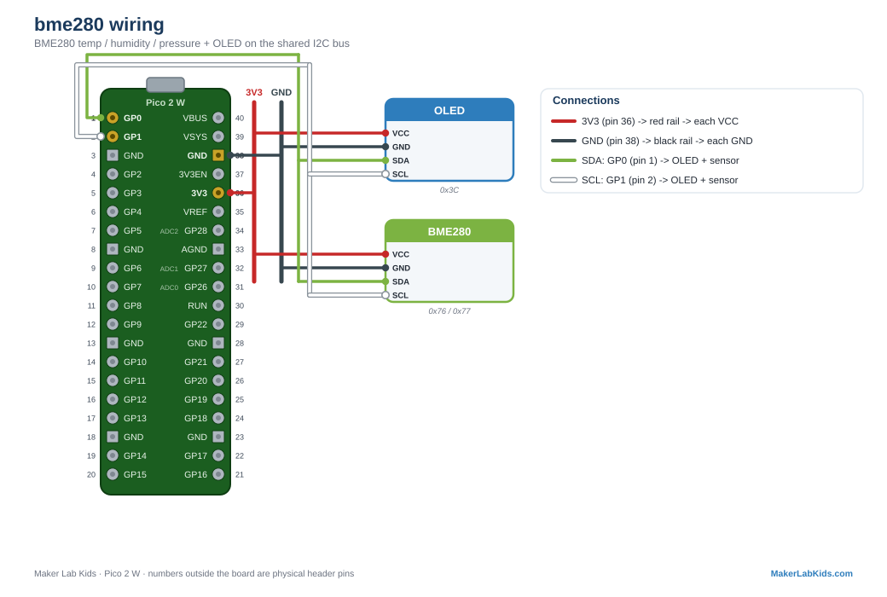

# BME280: Temperature, Humidity, Pressure

The environment sensor. Reads air temperature, relative humidity, and
barometric pressure over I2C. Also works with a BMP280 (its humidity-free
sibling; the demo reports humidity as n/a).

## Wiring

| BME280 pin | Pico |
| ---------- | ---- |
| VIN / VCC | 3V3 (pin 36) |
| GND | GND (any GND pin, e.g. 38) |
| SDA | GP0 (pin 1) |
| SCL | GP1 (pin 2) |

I2C address `0x76` or `0x77` (the demo finds either automatically).

## Wiring diagram

Also in the [lab guide](https://acklenx.github.io/raspberrypi/#wire-bme280). Red = 3V3, dark grey = GND (shared rails), green = SDA, white = SCL, yellow = signal, orange = VBUS 5V (alternate voltage). Numbers outside the board are physical header pins.

## Four tiers, from bare to mack daddy

| File | What it does | Truth light |
| ---- | ------------ | ----------- |
| `hello.py` | The fewest lines that prove the sensor works. Terminal only, no framework. | Solid ON while readings are good, OFF when not |
| `bench.py` | OLED + terminal, fault tolerant, hot-pluggable. No Wi-Fi. | Short blink = OK, long blink = trouble |
| `main.py` + `index.html` | Everything above plus the PicoLabN access point with a live dashboard at http://192.168.4.1 and JSON at `/data`. | Same as bench |
| `multi.py` | TWO hot-swappable BME280s (0x76 inside the bin, 0x77 outside), both on the OLED plus the temperature difference. | POST codes: one blink per sensor in order. `. .` = both happy, `_ .` = sensor 1 unhappy |

Files needed on the board: the tier you chose, plus `index.html` (web
version only), plus from `lib/`: `bme280.py` (all tiers), and
`picolab.py` + `ssd1306.py` (every tier except `hello.py`).

Note for `multi.py`: a BME280 board's address is set by its SDO pad or
pin (SDO to GND = `0x76`, SDO to 3V3 = `0x77`). Two sensors on one bus
need one of each.

## Fault tolerance (all demos work this way)

- Boots and runs fine with no sensor, no display, or neither.
- Plug the sensor in mid-run: readings appear within ~2 seconds.
- Plug the display in mid-run: it lights up within ~3 seconds.
- Terminal shows a startup banner and first readings immediately, then a
  heartbeat line every 5 seconds.
- The onboard LED never lies: if it is dark, the code is not running; if
  it is blinking, the blink pattern says exactly which part is unhappy.
