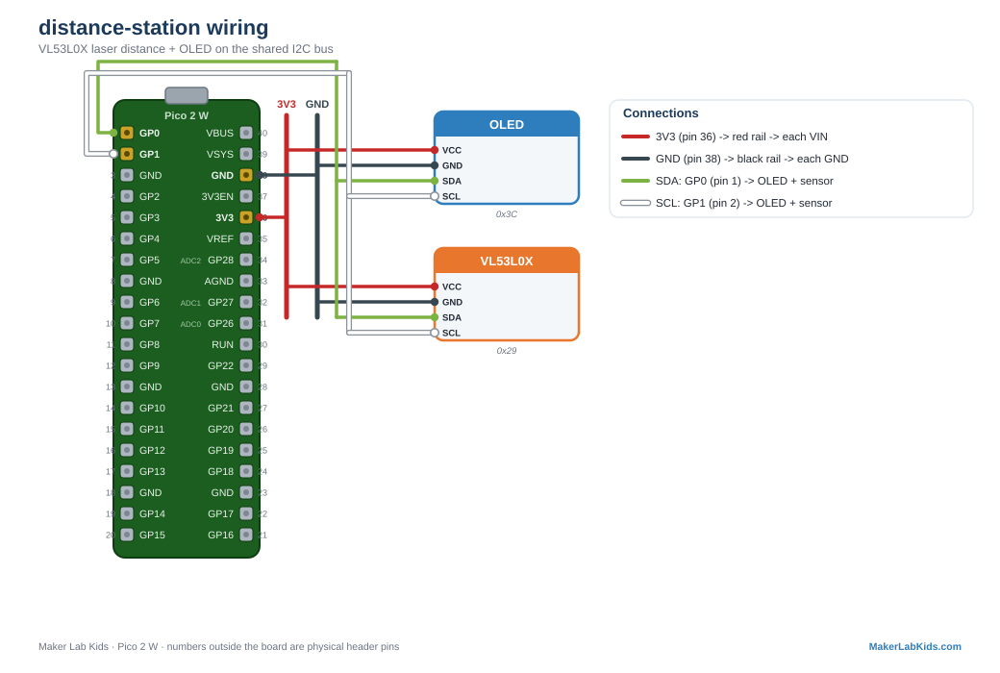

# Distance Station

**[Open this project in Viper IDE](https://viper-ide.org/?install=github:acklenx/raspberrypi/projects/distance-station/package.json)**: one click installs everything it needs onto a connected Pico.

The full class build: a Pico 2 W reads a VL53L0X time-of-flight laser
distance sensor, shows the distance on an SSD1306 OLED, and broadcasts its
own Wi-Fi network with a live web dashboard.

## Hardware

| Part | Connection |
| ---- | ---------- |
| VL53L0X distance sensor | 3V3 (pin 36), GND, SDA to GP0 (pin 1), SCL to GP1 (pin 2, address `0x29`) |
| SSD1306 OLED 128x64 | 3V3 (pin 36), GND, SDA to GP0 (pin 1), SCL to GP1 (pin 2, address `0x3C`) |

Both devices share the same two I2C wires. That is the point of I2C.

## Wiring diagram

Also in the [lab guide](https://acklenx.github.io/raspberrypi/#wire-distance-station). Red = 3V3, dark grey = GND (shared rails), green = SDA, white = SCL, yellow = signal, orange = VBUS 5V (alternate voltage). Numbers outside the board are physical header pins.

## Files to put on the board

| File | Purpose |
| ---- | ------- |
| `main.py` | The whole show: sensor, OLED, access point, webserver |
| `index.html` | The dashboard page the Pico serves |
| `../../lib/ssd1306.py` | OLED driver |
| `../../lib/vl53l0x.py` | Distance sensor driver |

Upload all four with Viper IDE, then reset the board (Ctrl+D in the
terminal, or power cycle).

## Using it

1. On boot the OLED shows the station's network name, like `PicoLab42`.
   Each board picks a random station number once and remembers it in
   `node_id.txt`.
2. Join that Wi-Fi network with a phone or laptop (no password).
3. Browse to **http://192.168.4.1** for the live dashboard: big number,
   moving bar, min/max tracking.
4. `http://192.168.4.1/data` returns raw JSON (`{"dist": 314}`) for
   anything you want to build on top: graphs, games, group data logging.

The station survives sensor or display failures: if a part is missing or
miswired it prints the error and keeps going with what it has, and the
dashboard shows `ERR` for a dead sensor.

## Calibration

The sensor's raw readings drift from true distance, so `main.py` maps raw
values to real millimeters with `CALIBRATION_MAP`, a table of measured
(raw, actual) pairs interpolated linearly. The tools in `tools/` are what
we used to collect those pairs with a tape measure. Recalibrate if you
mount the sensor differently: collect a few (raw, actual) points and edit
the table.

---

Fresh board? Flash the [tested MicroPython build](https://github.com/acklenx/raspberrypi/raw/main/firmware/RPI_PICO2_W-20260406-v1.28.0.uf2) first: hold BOOTSEL while plugging in, drop the file on the drive that appears, done. Details in [firmware/](../../firmware).
