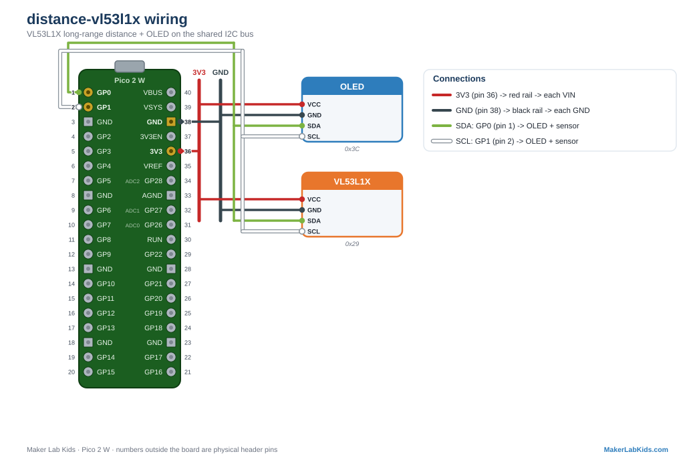

# VL53L1X: Long-Range Laser Distance (4 meters)

The VL53L0X's big sibling. Same time-of-flight idea, but it reaches to
about 4 meters instead of 1.2. Great for room-scale experiments:
people-counters, parking sensors, how-tall-is-it rigs.

## Wiring

| VL53L1X pin | Pico |
| ----------- | ---- |
| VIN | 3V3 (pin 36) |
| GND | GND (any GND pin, e.g. 38) |
| SDA | GP0 (pin 1) |
| SCL | GP1 (pin 2) |

**Address clash warning:** the VL53L1X and VL53L0X BOTH use I2C address
`0x29`. Only one of the two can be on the bus at a time. The driver
checks the chip's model id, so if you plug in the wrong one the demo
just reports "no sensor" instead of reading garbage.

## Wiring diagram

Also in the [lab guide](https://acklenx.github.io/raspberrypi/#wire-distance-vl53l1x). Red = 3V3, dark grey = GND (shared rails), green = SDA, white = SCL, yellow = signal, orange = VBUS 5V (alternate voltage). Numbers outside the board are physical header pins.

## Two versions

| File | What it does |
| ---- | ------------ |
| `bench.py` | OLED + terminal only. No Wi-Fi. |
| `main.py` + `index.html` | Everything above plus the PicoLabN access point with a live dashboard at http://192.168.4.1 (0 to 4 m bar, min/max) and JSON at `/data`. |

Files needed on the board: the version you chose, plus `index.html` (web
version only), plus from `lib/`: `picolab.py`, `vl53l1x.py`, `ssd1306.py`.

## Notes

- The sensor free-runs at roughly 10 readings per second in long-range
  mode (the default here).
- "No target" is a real answer: beyond ~4 m, or nothing reflective in
  view, the range status goes invalid and the demo says so instead of
  showing a junk number.
- Driver: `lib/vl53l1x.py`, adapted from the MIT-licensed
  drakxtwo/vl53l1x_pico port of the ST ultra lite driver.
- Fault tolerance is the same as every demo: sensor and display are both
  optional and hot-pluggable, no restarts needed.
