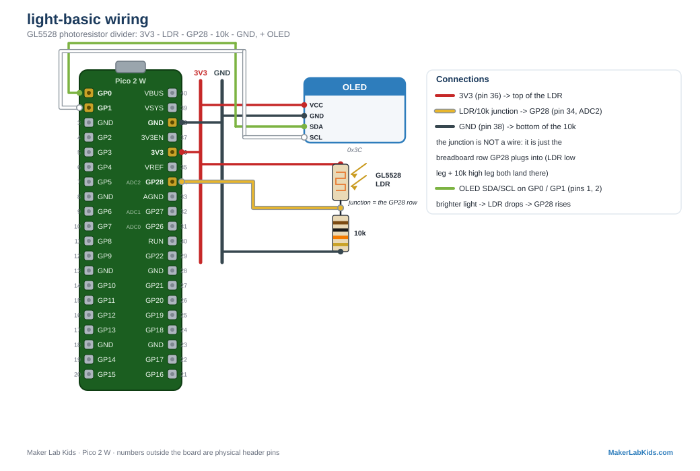

# GL5528 LDR: Basic Light Level

The cheap-and-cheerful light demo. A GL5528 photoresistor (LDR) changes
resistance with light; putting it in a voltage divider turns that into a
voltage the Pico's ADC can read. More light = lower LDR resistance =
higher voltage on the pin.

## Wiring

| Part | Connection |
| ---- | ---------- |
| LDR leg 1 | 3V3 (pin 36) |
| LDR leg 2 | GP28 (pin 34, and one leg of the 10k resistor) |
| 10k resistor | GP28 (pin 34) to GND |

GP28 is ADC2. The LDR has no polarity; either leg can face 3V3.

## Wiring diagram

Also in the [lab guide](https://acklenx.github.io/raspberrypi/#wire-light-basic). Red = 3V3, dark grey = GND (shared rails), green = SDA, white = SCL, yellow = signal, orange = VBUS 5V (alternate voltage). Numbers outside the board are physical header pins.

## Three versions

| File | What it does |
| ---- | ------------ |
| `bench.py` | OLED + terminal only. No Wi-Fi. |
| `main.py` + `index.html` | Everything above plus the PicoLabN access point with a live dashboard at http://192.168.4.1 and JSON at `/data`. |
| `hello_ads1115.py` | The same divider read through an ADS1115 (I2C `0x48`) instead of a Pico ADC pin: the stepping stone to the worm-bin build, where all the slow analog signals ride the ADS1115. Bonus: unlike a bare ADC pin, it can actually detect the missing chip, so the truth light means it. |

Files needed on the board: the version you chose, plus `index.html` (web
version only), plus from `lib/`: `picolab.py`, `ssd1306.py` (bench and
web), or `ads1115.py` (the ADS1115 version).

## Fault tolerance (all demos work this way)

- Boots and runs fine with no display; the OLED lights up within ~3
  seconds of being plugged in mid-run.
- One honest limitation: an ADC pin cannot tell whether the divider is
  actually wired up. If nothing is connected, the floating pin reads
  electrical noise, so the numbers wander instead of reporting
  "unplugged". That is a good discussion point in class.
- Terminal shows a startup banner and first readings immediately, then a
  heartbeat line every 5 seconds.

---

Fresh board? Flash the [tested MicroPython build](https://github.com/acklenx/raspberrypi/raw/main/firmware/RPI_PICO2_W-20260406-v1.28.0.uf2) first: hold BOOTSEL while plugging in, drop the file on the drive that appears, done. Details in [firmware/](../../firmware).
