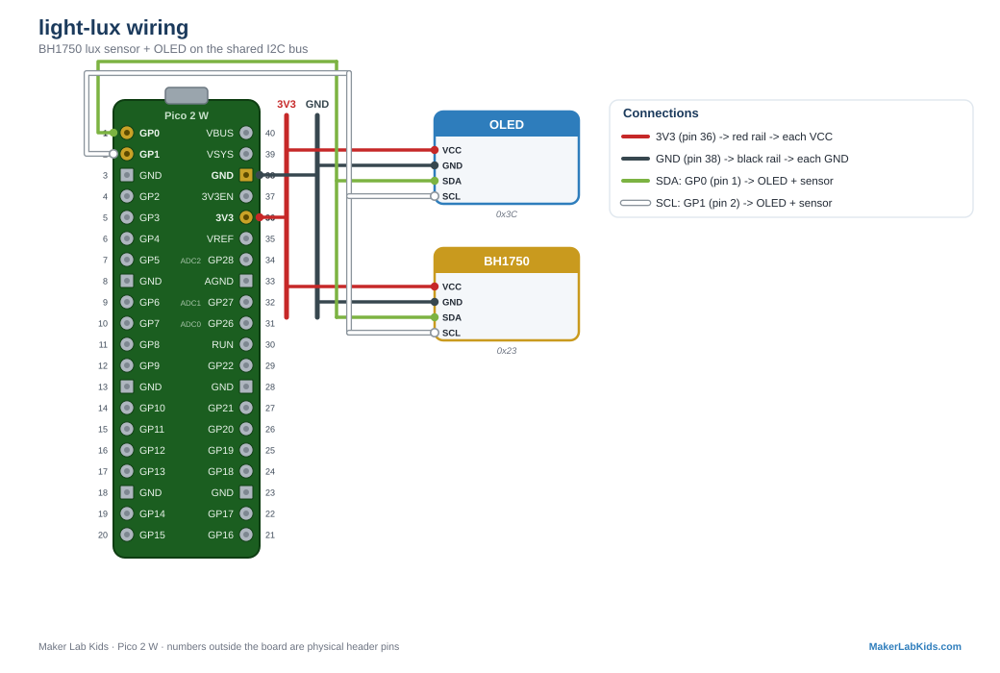

# BH1750: Light in Real Lux

The higher-quality light demo. The BH1750 is a digital lux meter: instead
of a rough "brighter / darker" voltage, it reports illuminance in real
lux over I2C, the same unit lighting engineers use. Roughly: moonlight is
under 1 lux, a classroom is 300 to 500 lux, direct sun is over 30,000.

## Wiring

| BH1750 pin | Pico |
| ---------- | ---- |
| VCC | 3V3 (pin 36) |
| GND | GND (any GND pin, e.g. 38) |
| SDA | GP0 (pin 1) |
| SCL | GP1 (pin 2) |
| ADDR | leave unconnected (address `0x23`) |

It shares the I2C bus with the OLED (and any other I2C sensors).

## Wiring diagram

Also in the [lab guide](https://acklenx.github.io/raspberrypi/#wire-light-lux). Red = 3V3, dark grey = GND (shared rails), green = SDA, white = SCL, yellow = signal, orange = VBUS 5V (alternate voltage). Numbers outside the board are physical header pins.

## Two versions

| File | What it does |
| ---- | ------------ |
| `bench.py` | OLED + terminal only. No Wi-Fi. |
| `main.py` + `index.html` | Everything above plus the PicoLabN access point with a live dashboard at http://192.168.4.1 and JSON at `/data`. |

Files needed on the board: the version you chose, plus `index.html` (web
version only), plus from `lib/`: `picolab.py`, `bh1750.py`, `ssd1306.py`.

## Fault tolerance (all demos work this way)

- Boots and runs fine with no sensor, no display, or neither.
- Plug the sensor in mid-run: readings appear within ~2 seconds.
- Plug the display in mid-run: it lights up within ~3 seconds.
- Terminal shows a startup banner and first readings immediately, then a
  heartbeat line every 5 seconds.
