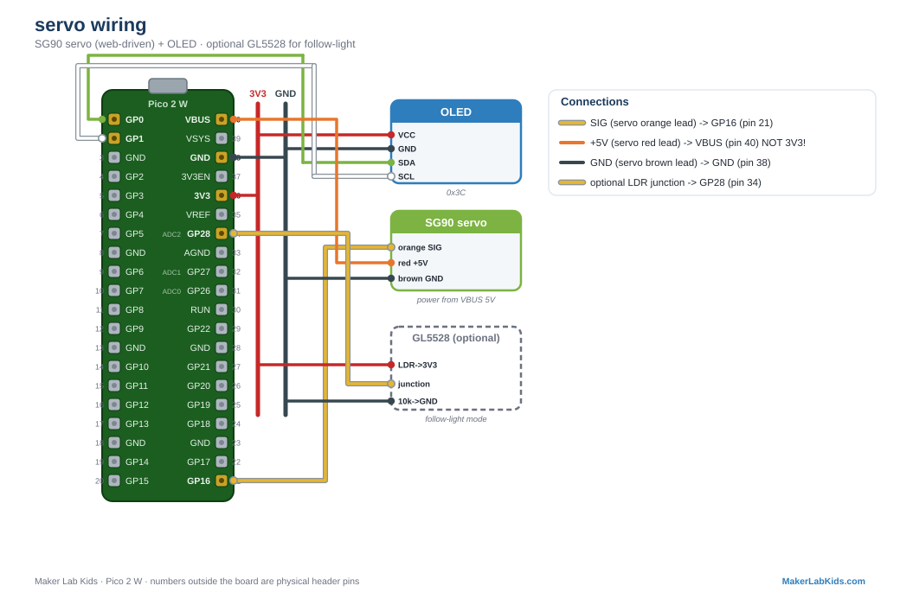

# Servo: Move Something In Real Life

An SG90 hobby servo driven by the Pico's PWM, controlled from a web page:
a slider, an automatic sweep mode, and a "follow light" mode where an
optional photoresistor steers the horn. Sensors moving the real world.

## Wiring

| Servo wire | Pico |
| ---------- | ---- |
| Orange (signal) | GP16 (pin 21) |
| Red (power) | VBUS (pin 40, 5V) |
| Brown (ground) | GND (any GND pin, e.g. 38) |

**Power the servo from VBUS, not 3V3.** The 3V3 regulator cannot feed a
servo motor. Always share GND between servo and Pico. An SG90 runs fine
from USB power; a stalled MG995 (the strong servo) does not, give it its
own 5V supply with a shared ground.

### Optional, for "follow light" mode

| Part | Connection |
| ---- | ---------- |
| GL5528 photoresistor | one leg to 3V3 (pin 36), other leg to GP28 (pin 34) |
| 10k resistor | GP28 (pin 34) to GND |

## Wiring diagram

Also in the [lab guide](https://acklenx.github.io/raspberrypi/#wire-servo). Red = 3V3, dark grey = GND (shared rails), green = SDA, white = SCL, yellow = signal, orange = VBUS 5V (alternate voltage). Numbers outside the board are physical header pins.

## Two versions

| File | What it does |
| ---- | ------------ |
| `bench.py` | Slow automatic 0 to 180 sweep, angle on OLED + terminal. No Wi-Fi. |
| `main.py` + `index.html` | PicoLab-N access point; dashboard at http://192.168.4.1 with a live dial, a slider, and Manual / Sweep / Follow light modes. JSON at `/data`, control at `/set?angle=N` and `/set?mode=manual|sweep|auto`. |

Files needed on the board: the version you chose, plus `index.html` (web
version only), plus from `lib/`: `picolab.py` and `ssd1306.py`. No sensor
driver needed.

## Fault tolerance (all demos work this way)

- Boots and runs fine with no display; plug it in mid-run and it lights
  up within ~3 seconds.
- A servo gives no feedback, so the demo cannot detect whether one is
  plugged in. It keeps commanding angles either way ("ok" is always true
  in `/data`), and the servo starts moving the moment it is connected.
- Terminal shows a startup banner immediately, then a heartbeat line
  every 5 seconds, plus a line for every command from the web page.
