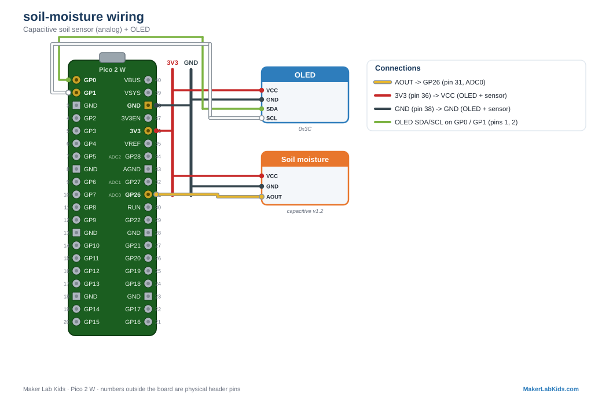

# Soil Moisture: Capacitive Sensor v1.2

Reads how wet the soil is. The sensor changes capacitance with moisture,
and outputs a voltage the Pico reads on an analog pin. More moisture
means a LOWER voltage, so the demo flips it into a friendly 0-100%.

Make sure the board is the **capacitive v1.2** type (the long paddle with
no exposed metal traces). Do not submerge it above the marked line; the
electronics at the top are not waterproof.

## Wiring

| Sensor pin | Pico |
| ---------- | ---- |
| VCC | 3V3 (pin 36) |
| GND | GND (any GND pin, e.g. 38) |
| AOUT | GP26 (pin 31, ADC0) |

## Wiring diagram

Also in the [lab guide](https://acklenx.github.io/raspberrypi/#wire-soil-moisture). Red = 3V3, dark grey = GND (shared rails), green = SDA, white = SCL, yellow = signal, orange = VBUS 5V (alternate voltage). Numbers outside the board are physical header pins.

## Two versions

| File | What it does |
| ---- | ------------ |
| `bench.py` | OLED + terminal only. No Wi-Fi. |
| `main.py` + `index.html` | Everything above plus the PicoLabN access point with a live dashboard at http://192.168.4.1 and JSON at `/data`. |

Files needed on the board: the version you chose, plus `index.html` (web
version only), plus from `lib/`: `picolab.py`, `ssd1306.py`.

## Calibration

Every sensor is a little different. To calibrate yours:

1. Run the demo with the probe dry, in air. Note the `raw` value. That
   is your `DRY_RAW`.
2. Stand the probe in a cup of water up to the marked line. Note the
   `raw` value. That is your `WET_RAW`.
3. Edit the two constants at the top of `bench.py` / `main.py`.

## Fault tolerance, with one honest caveat

The display is optional and hot-pluggable as usual. But an analog pin
cannot tell whether the sensor is unplugged: with nothing connected,
GP26 floats and reads electrical noise, so the demo happily shows
garbage numbers. That is not a bug, it is physics. The I2C demos (like
the BME280) can detect a missing part; analog demos cannot. If the
numbers look random and refuse to settle, check the wiring.
