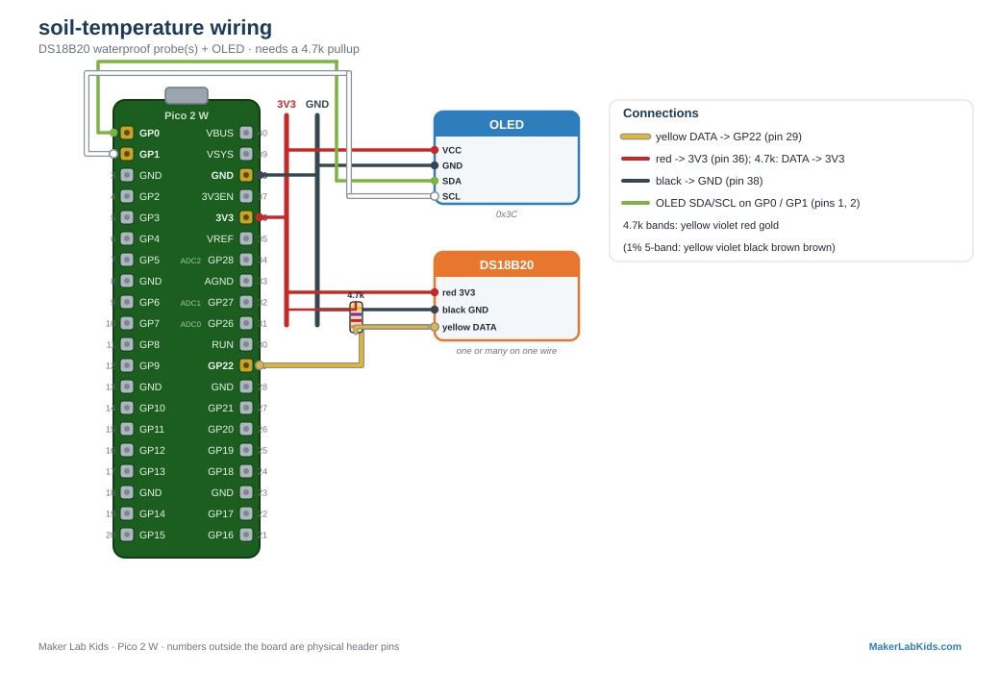

# Soil Temperature: DS18B20 Waterproof Probes

**[Open this project in Viper IDE](https://viper-ide.org/?install=github:acklenx/raspberrypi/projects/soil-temperature/package.json)**: one click installs everything it needs onto a connected Pico.

Reads temperature from DS18B20 probes: the steel-tipped waterproof ones
made to bury in a worm bin. They speak the 1-Wire protocol, which means
MANY probes can share one single data wire and the demo reads them all,
each with its own factory-burned serial number.

## Wiring

| Probe wire | Pico |
| ---------- | ---- |
| Red | 3V3 (pin 36) |
| Black | GND (any GND pin, e.g. 38) |
| Yellow (data) | GP22 (pin 29) |

**Required:** a 4.7k ohm resistor between GP22 and 3V3 (the bus pullup).
Without it you get no probes found or garbage CRC errors. One resistor
serves the whole bus no matter how many probes you add.

## Wiring diagram

Also in the [lab guide](https://acklenx.github.io/raspberrypi/#wire-soil-temperature). Red = 3V3, dark grey = GND (shared rails), green = SDA, white = SCL, yellow = signal, orange = VBUS 5V (alternate voltage). Numbers outside the board are physical header pins.

## Two versions

| File | What it does |
| ---- | ------------ |
| `bench.py` | OLED + terminal only. No Wi-Fi. |
| `main.py` + `index.html` | Everything above plus the PicoLabN access point with a live dashboard at http://192.168.4.1 and JSON at `/data`. |

Files needed on the board: the version you chose, plus `index.html` (web
version only), plus from `lib/`: `picolab.py`, `ssd1306.py`. The 1-Wire
drivers (`onewire`, `ds18x20`) are built into MicroPython.

## Fault tolerance (all demos work this way)

- Boots and runs fine with no probes, no display, or neither.
- Plug a probe in mid-run: readings appear within a couple of seconds.
- The wire is rescanned every cycle, so a probe added mid-run just
  appears, and an unplugged one drops off. No replugging ritual.
- Each probe is read separately: ONE bad probe cannot take down the
  rest. Its reading shows "fault!" and its truth-light slot goes long.
- The truth light runs POST codes: one blink per probe, in wire order.
  Short = OK, long = trouble. Five probes reading `. . . _ .` means
  probe 4 has a loose wire; fix it and the pattern heals. Add a sixth
  probe and the pattern grows to six blinks. Dark = code not running.
- Readings never block the loop: the DS18B20 needs 750 ms to convert,
  so the demo reads the finished conversion and immediately starts the
  next one in the background.
- Terminal shows a startup banner and first readings immediately, then a
  heartbeat line every 5 seconds.

---

Fresh board? Flash the [tested MicroPython build](https://github.com/acklenx/raspberrypi/raw/main/firmware/RPI_PICO2_W-20260406-v1.28.0.uf2) first: hold BOOTSEL while plugging in, drop the file on the drive that appears, done. Details in [firmware/](../../firmware).
