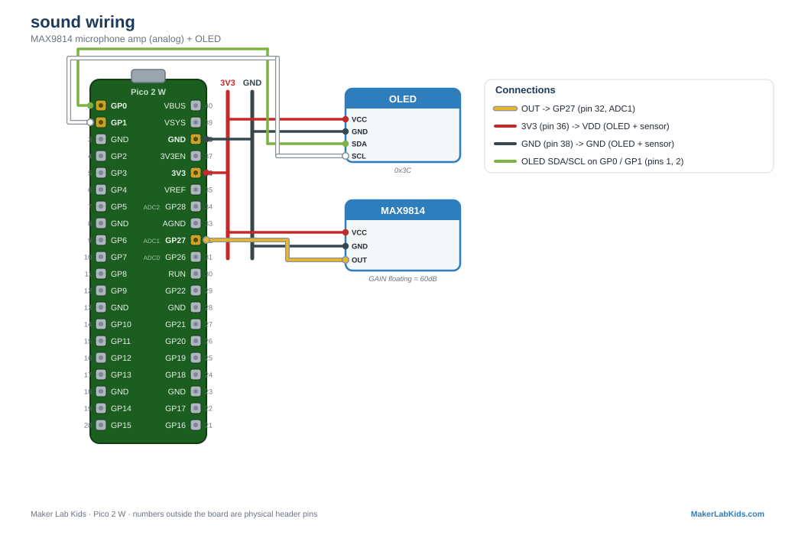

# MAX9814: Sound Level Meter

A microphone with a built-in amplifier and automatic gain control (AGC).
The AGC quietly turns its own volume up and down so quiet sounds are
audible and loud sounds do not clip. The demo turns it into a sound level
meter: clap, snap, or talk and watch the bars jump on the OLED and the
dashboard.

Loudness here is the size of the audio wiggle, not the average voltage:
the demo samples the pin flat out for 25ms and reports max minus min.

## Wiring

| MAX9814 pin | Pico |
| ----------- | ---- |
| VDD | 3V3 (pin 36) |
| GND | GND (any GND pin, e.g. 38) |
| OUT | GP27 (pin 32) |
| GAIN | leave floating (60dB, fine for this demo) |
| AR | leave floating |

GP27 is ADC1.

## Wiring diagram

Also in the [lab guide](https://acklenx.github.io/raspberrypi/#wire-sound). Red = 3V3, dark grey = GND (shared rails), green = SDA, white = SCL, yellow = signal, orange = VBUS 5V (alternate voltage). Numbers outside the board are physical header pins.

## Two versions

| File | What it does |
| ---- | ------------ |
| `bench.py` | OLED + terminal only. No Wi-Fi. |
| `main.py` + `index.html` | Everything above plus the PicoLabN access point with a live dashboard at http://192.168.4.1 and JSON at `/data`. |

Files needed on the board: the version you chose, plus `index.html` (web
version only), plus from `lib/`: `picolab.py`, `ssd1306.py`.

## Try it

Clap once: the live bar spikes and the orange peak bar holds high for a
moment, then slowly falls back. Hum at a steady volume and the live bar
holds steady. Great for a "how loud is the classroom" experiment.

## Fault tolerance (all demos work this way)

- Boots and runs fine with no display; the OLED lights up within ~3
  seconds of being plugged in mid-run.
- One honest limitation: an ADC pin cannot tell whether the mic is
  actually wired up. If nothing is connected, the floating pin reads
  electrical noise, so the level wanders instead of reporting
  "unplugged".
- Terminal shows a startup banner and first readings immediately, then a
  heartbeat line every 5 seconds.

---

Fresh board? Flash the [tested MicroPython build](https://github.com/acklenx/raspberrypi/raw/main/firmware/RPI_PICO2_W-20260406-v1.28.0.uf2) first: hold BOOTSEL while plugging in, drop the file on the drive that appears, done. Details in [firmware/](../../firmware).
